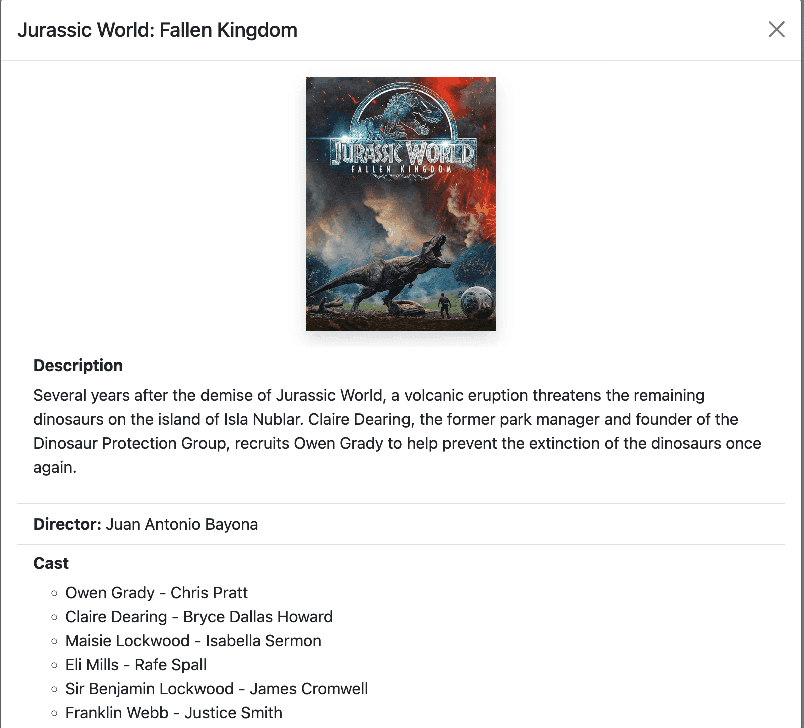

# Movie List Web

## Introduction

Movie List is a web application that allows users to browse and search for movies. It fetches movie data from the AlphaCamp API and displays it in a user-friendly interface.

## Usage

1. Clone the repository to your local machine.
2. Install dependencies using `npm install`.
3. Start the development server with `npm start`.
4. Open your browser and navigate to http://localhost:3000 to view the app.

## Features

- Browse a list of all movies

- View details of a specific movie

- Search for movies by title

- Save favorite movies to local storage

## Requirements

- Node.js
- Html
- Css
- npm
